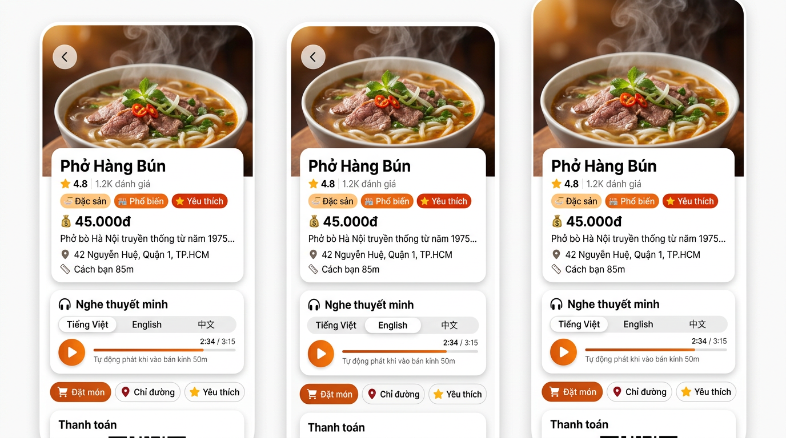
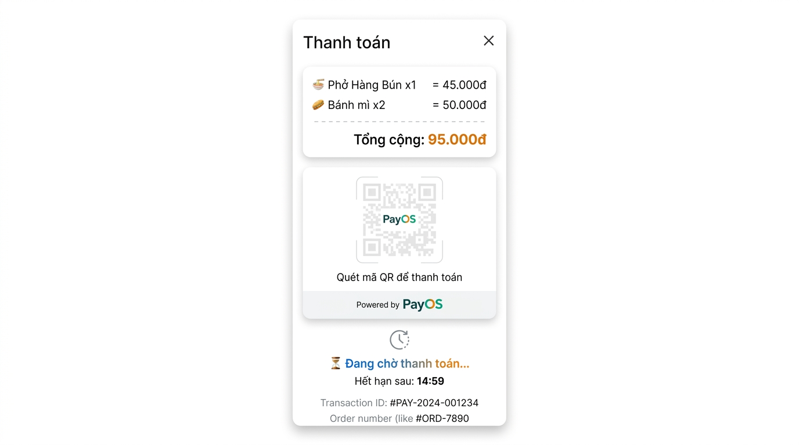
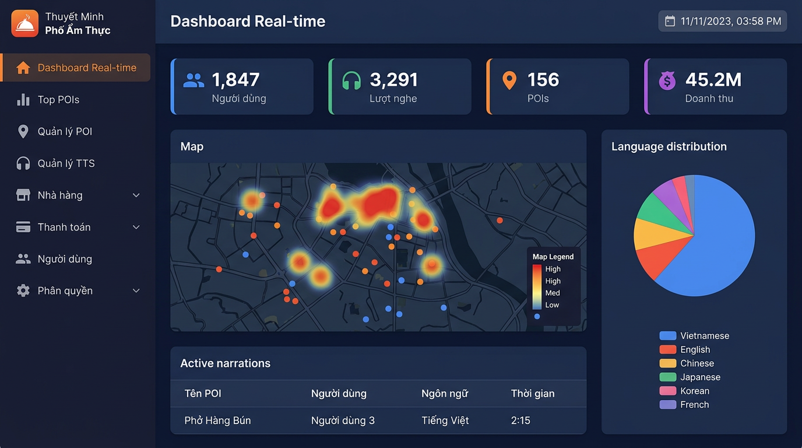

# 🍜 Thuyết Minh Tự Động Phố Ăm Thực

> **Tự động phát thuyết minh đa ngôn ngữ khi du khách bước vào điểm ẩm thực — như có một hướng dẫn viên du lịch trong túi.**

[](https://adoptium.net/)
[](https://spring.io/projects/spring-boot)
[](https://react.dev/)
[](https://expo.dev/)
[](https://www.typescriptlang.org/)
[](https://www.mysql.com/)

---

## 📌 Mục lục

- [Giới thiệu](#-giới-thiệu)
- [Tính năng chính](#-tính-năng-chính)
- [Hình ảnh dự án](#-hình-ảnh-dự-án)
- [Kiến trúc hệ thống](#-kiến-trúc-hệ-thống)
- [Công nghệ sử dụng](#-công-nghệ-sử-dụng)
- [Cấu trúc thư mục](#-cấu-trúc-thư-mục)
- [Hướng dẫn cài đặt](#-hướng-dẫn-cài-đặt)
- [Thông tin hỗ trợ](#-thông-tin-hỗ-trợ)

---

## 🎯 Giới thiệu

**Thuyết Minh Phố Ăm Thực** là hệ thống **web + mobile** giúp du khách khám phá ẩm thực đường phố Việt Nam một cách sinh động. Khi bước vào bán kính ~50m của một quán ăn, ứng dụng tự động phát **thuyết minh đa ngôn ngữ** (Tiếng Việt, Anh, Trung, Nhật, Hàn, Pháp) về món ăn, lịch sử, và cách thưởng thức — như có một hướng dẫn viên du lịch bên cạnh.

Hệ thống hướng tới:

- 🌍 **Du khách quốc tế** muốn hiểu và thưởng thức ẩm thực Việt Nam
- 📱 **Người dùng địa phương** muốn khám phá ẩm thực xung quanh
- 🏪 **Chủ quán / nhà hàng** muốn giới thiệu món ăn chuyên nghiệp hơn
- 🏛️ **Đơn vị quản lý du lịch** cần dashboard theo dõi hoạt động thuyết minh

---

## ⭐ Tính năng chính

### 📍 Geofence — Tự động kích hoạt theo vị trí

- Sử dụng **GPS** để phát hiện khi người dùng bước vào bán kính của điểm ẩm thực (mặc định 50m)
- **Thuật toán ưu tiên 3 cấp** khi nhiều POI trùng bán kính: khoảng cách → mức ưu tiên (priority) → ID
- **Cooldown 5 phút** tránh phát lặp khi người dùng di chuyển qua lại

### 🎧 Thuyết minh đa ngôn ngữ (TTS)

- Tự động tạo file audio từ **Google Cloud Text-to-Speech**
- Hỗ trợ **6 ngôn ngữ**: Tiếng Việt 🇻🇳 · Anh 🇬🇧 · Trung 🇨🇳 · Nhật 🇯🇵 · Hàn 🇰🇷 · Pháp 🇫🇷
- Lưu trữ file MP3 trên **AWS S3**, phát trực tiếp hoặc tải offline
- Giao diện tạo/nhóm/chỉnh sửa audio cho admin

### 🗺️ Bản đồ tương tác

- Hiển thị điểm ẩm thực (POI) trên bản đồ với marker tùy loại
- Bộ lọc theo danh mục: đồ đường, nhà hàng, quán cà phê, chợ, khách sạn
- Khoảng cách theo thời gian thực, chỉ đường đến quán

### 💳 Thanh toán PayOS

- Quét **mã QR PayOS** để thanh toán trực tiếp tại quán
- Tích hợp webhook xác nhận thanh toán tự động
- Dashboard admin theo dõi doanh thu theo tháng/năm
- Hỗ trợ thanh toán nhiều món với số lượng

### 📲 Ứng dụng di động (Expo)

- Phát nhạc nền khi vào bán kính POI
- **Chế độ offline**: tải trước POI + audio về SQLite, không cần mạng
- Quét QR code để tra cứu nhanh
- Lịch sử nghe và cài đặt ngôn ngữ ưu tiên

### 🖥️ Dashboard Admin (Web)

- **Real-time heatmap**: theo dõi người dùng đang nghe trên bản đồ
- **Bảng thống kê**: doanh thu, lượt nghe, POIs, người dùng
- Quản lý POI với tạo QR code tự động
- Quản lý TTS Audio Groups (nhóm audio đa ngôn ngữ)
- Quản lý nhà hàng, thanh toán, người dùng, phân quyền
- Thống kê doanh thu theo tháng/năm

### 🔐 Xác thực & Phân quyền

- Đăng nhập bằng **JWT + Spring Security**
- Phân quyền động theo vai trò: **Admin** / **User**
- Tự động gắn token khi gọi API qua Axios interceptor
- Redirect về trang đăng nhập khi hết phiên

### 🔄 Đồng bộ Offline

- Kiểm tra cấu hình thiết bị (RAM ≥ 4GB → bật offline)
- Sync POI + metadata + file MP3 về SQLite
- Đánh version để chỉ sync lại dữ liệu thay đổi
- Phát audio từ local file khi không có mạng

---

## 🖼️ Hình ảnh dự án

### 📱 Ứng dụng di động — Trang chủ


> Giao diện trang chủ mobile với danh sách điểm ẩm thực gần bạn, tìm kiếm, và chọn ngôn ngữ thuyết minh.

---

### 📱 Ứng dụng di động — Chi tiết điểm ẩm thực



> Màn hình chi tiết POI: hình ảnh món ăn, thông tin giá/địa chỉ, audio player đa ngôn ngữ, và nút đặt món.

---

### 📱 Ứng dụng di động — Thanh toán PayOS



> Màn hình thanh toán với QR PayOS, thông tin đơn hàng, và đếm ngược thời gian thanh toán.

---

### 🖥️ Dashboard Admin — Real-time



> Giao diện dashboard admin: heatmap người dùng đang nghe, bảng thống kê tổng quan, và danh sách narration đang phát.

---

## 🏗️ Kiến trúc hệ thống

```
┌─────────────────────────────────────────────────────────┐
│                      CLIENTS                            │
│  ┌──────────────────┐     ┌─────────────────────────┐  │
│  │   Mobile App     │     │    Web Admin Panel      │  │
│  │  (Expo/React     │     │  (React + Vite +        │  │
│  │   Native)        │     │   Ant Design)           │  │
│  └────────┬─────────┘     └────────────┬────────────┘  │
│           │                             │               │
└───────────┼─────────────────────────────┼───────────────┘
            │         HTTPS / REST       │
            ▼                             ▼
┌─────────────────────────────────────────────────────────┐
│                      BACKEND                            │
│                Spring Boot 3.2.5                         │
│                    Java 17                               │
│                                                          │
│  ┌──────────────┐  ┌──────────────┐  ┌──────────────┐  │
│  │ App Client   │  │  Admin API   │  │   TTS API    │  │
│  │  Controller  │  │  Controller  │  │  Controller  │  │
│  └──────┬───────┘  └──────┬───────┘  └──────┬───────┘  │
│         │                 │                  │          │
│  ┌──────▼─────────────────▼──────────────────▼───────┐  │
│  │              SERVICE LAYER                         │  │
│  │  • GeofenceService (Haversine distance calc)       │  │
│  │  • TTSService (Google Cloud TTS synthesis)         │  │
│  │  • PaymentService (PayOS integration)             │  │
│  │  • NarrationService (Audio playback tracking)     │  │
│  │  • DeviceConfigService (Offline capability)      │  │
│  └──────────────────────┬────────────────────────────┘  │
│                         │                                │
│  ┌──────────────────────▼────────────────────────────┐  │
│  │             REPOSITORY LAYER (JPA)                  │  │
│  │  POI | TTSAudioGroup | Payment | Restaurant |      │  │
│  │  ActiveNarration | QueueSession | NarrationLog |   │  │
│  │  DeviceConfig | User | Role | Permission            │  │
│  └──────────────────────┬────────────────────────────┘  │
└─────────────────────────┼────────────────────────────────┘
                          │
        ┌─────────────────┼──────────────────┐
        ▼                 ▼                  ▼
┌──────────────┐  ┌──────────────┐  ┌──────────────────┐
│    MySQL     │  │  AWS S3      │  │  Google Cloud     │
│  (Flyway     │  │  (TTS Audio  │  │  TTS + Translate  │
│   Migrations)│  │   Storage)   │  │                   │
└──────────────┘  └──────────────┘  └──────────────────┘
```

### Luồng hoạt động chính

```
1. User mở app → GPS lấy vị trí
         │
         ▼
2. Gọi /app/pois/nearby → Backend trả danh sách POI trong bán kính
         │
         ▼
3. Backend tính khoảng cách Haversine → áp dụng thuật toán ưu tiên
         │
         ▼
4. POI được chọn → kiểm tra cooldown, gọi TTSService
         │
         ▼
5. Trả về audio URL (từ S3) + metadata → Mobile phát audio
         │
         ▼
6. User nghe → Backend ghi NarrationLog → Dashboard cập nhật real-time
```

---

## 🛠️ Công nghệ sử dụng

### 🔙 Backend — Spring Boot

| Thành phần | Công nghệ | Mô tả |
|---|---|---|
| Ngôn ngữ | Java 17 | Adoptium Temurin |
| Framework | Spring Boot 3.2.5 | Core framework |
| Bảo mật | Spring Security + JWT | Xác thực & phân quyền |
| Database | MySQL 8 + Spring Data JPA | Lưu trữ dữ liệu |
| Migration | Flyway | Quản lý schema |
| TTS | Google Cloud TTS v1 | Tổng hợp giọng nói |
| Dịch thuật | Google Cloud Translate | Dịch đa ngôn ngữ |
| Lưu trữ file | AWS S3 | Lưu audio & hình ảnh |
| Thanh toán | PayOS API | Tạo & xác minh QR |
| Validation | Hibernate Validator | Validate DTO |
| API Docs | Swagger OpenAPI 3 | Tài liệu API |

### 🎨 Frontend Web — React + Vite

| Thành phần | Công nghệ | Mô tả |
|---|---|---|
| Framework | React 18.3.1 | UI library |
| Build | Vite 5.4.8 | Dev server & bundler |
| Ngôn ngữ | TypeScript 5.6 | Type safety |
| UI Library | Ant Design 5.21.6 | Component library |
| Maps | Leaflet + OpenStreetMap | Bản đồ |
| State | Redux Toolkit 1.9.7 | Global state |
| Routing | React Router 6.27.0 | Client-side routing |
| HTTP | Axios | REST client |

### 📱 Mobile App — Expo (React Native)

| Thành phần | Công nghệ | Mô tả |
|---|---|---|
| Framework | Expo 54 + RN 0.81.5 | Cross-platform mobile |
| Ngôn ngữ | TypeScript | Type safety |
| Navigation | React Navigation 7 | Screen navigation |
| GPS | Expo Location | Vị trí người dùng |
| Camera | Expo Camera | Quét QR code |
| Audio | Expo AV | Phát audio |
| TTS | Expo Speech | Text-to-Speech |
| Database | Expo SQLite | Offline storage |
| HTTP | Axios | REST client |

### 🗄️ Database

| Bảng | Mô tả |
|---|---|
| `pois` | Điểm ẩm thực (GPS, bán kính, QR code) |
| `tts_audio_groups` | Nhóm audio cho POI |
| `tts_audio_group_audios` | Các file audio theo ngôn ngữ |
| `restaurants` | Thông tin nhà hàng & PayOS |
| `payments` | Lịch sử thanh toán |
| `active_narrations` | Đang phát real-time |
| `queue_sessions` | Phiên nghe của user |
| `narration_logs` | Lịch sử nghe |
| `device_configs` | Cấu hình & sync offline |
| `users` | Tài khoản |
| `roles` / `permissions` | Phân quyền RBAC |

---

## 📁 Cấu trúc thư mục

```
ThuyetMinhPhoAmThuc/
├── README.md                        # Tài liệu dự án
├── POI.md                           # Chi tiết thiết kế POI
├── ARCHITECTURE_ANALYSIS.md        # Phân tích kiến trúc
│
├── backend/demo/                    # Spring Boot Backend
│   ├── pom.xml                     # Maven dependencies
│   └── src/main/java/com/example/demo/
│       ├── controller/             # REST Controllers
│       │   ├── AppClientController.java    # API cho mobile
│       │   ├── AdminController.java        # API cho admin
│       │   ├── TTSController.java           # TTS synthesis
│       │   └── AdminPaymentController.java # Thanh toán
│       ├── service/                # Business logic
│       │   ├── impl/
│       │   │   ├── GeofenceServiceImpl.java  # Haversine algorithm
│       │   │   ├── TTSAudioServiceImp.java   # Google TTS
│       │   │   ├── PaymentServiceImpl.java   # PayOS
│       │   │   └── AppClientServiceImpl.java # App client logic
│       │   └── *.java
│       ├── domain/                 # JPA Entities
│       ├── repository/            # Spring Data JPA
│       ├── dto/                   # Data Transfer Objects
│       ├── config/                # Spring configurations
│       └── resources/
│           ├── application.yml    # Config
│           └── sql/               # Flyway migrations
│
├── front_end/01-react-vite-starter/ # React Frontend
│   ├── package.json
│   └── src/
│       ├── pages/
│       │   ├── admin/             # Admin pages
│       │   │   ├── DashboardRealTime/   # Heatmap + live data
│       │   │   ├── POI/                # POI CRUD
│       │   │   ├── TTSAudio/           # TTS management
│       │   │   ├── Restaurant/         # Restaurant CRUD
│       │   │   ├── Payment/            # Payment history
│       │   │   └── User/               # User & Role management
│       │   └── client/             # Client pages
│       │       └── TTSClientPage/  # Interactive map + player
│       ├── api/                   # Axios API services
│       ├── redux/                 # Redux slices
│       └── components/           # Shared components
│
├── mobile_app/ThuyetMinhAmThucApp/ # Expo Mobile App
│   ├── app.json
│   └── src/
│       ├── screens/
│       │   ├── HomeScreen.tsx          # Danh sách POI
│       │   ├── MapScreen.tsx          # Bản đồ tương tác
│       │   ├── POIDetailScreen.tsx    # Chi tiết + audio player
│       │   ├── QRScannerScreen.tsx    # Quét QR
│       │   ├── PaymentScreen.tsx      # Thanh toán
│       │   ├── HistoryScreen.tsx      # Lịch sử nghe
│       │   └── SettingsScreen.tsx     # Ngôn ngữ, offline
│       ├── services/
│       │   ├── api.ts                 # Axios client
│       │   ├── offlineDb.ts           # SQLite operations
│       │   ├── deviceService.ts       # Device config
│       │   └── audioService.ts        # Audio playback
│       └── navigation/
│           └── AppNavigator.tsx
│
├── screenshots/                    # Hình ảnh dự án
│   ├── mobile-home.png
│   ├── mobile-poi-detail.png
│   ├── mobile-payment.png
│   └── admin-dashboard.png
│
└── uploads/                       # File upload (gitignored)
    ├── food-images/
    └── tts-audios/
```

---

## 🚀 Hướng dẫn cài đặt

### ✅ 1. Yêu cầu hệ thống

| Thành phần | Phiên bản tối thiểu |
|---|---|
| Java (JDK) | 17+ |
| Node.js | 18+ |
| npm | 9+ |
| MySQL | 8.0+ |
| Docker (tùy chọn) | 24+ |

### ✅ 2. Cài đặt Backend

```bash
# Di chuyển vào thư mục backend
cd backend/demo

# Cài đặt Maven dependencies & build
./mvnw clean install

# Chạy ứng dụng (sẽ chạy Flyway migration tự động)
./mvnw spring-boot:run

# Backend sẽ chạy tại: http://localhost:8080
```

> **Lưu ý:** Cấu hình database, AWS S3, Google Cloud, và PayOS trong `application.yml` trước khi chạy.

### ✅ 3. Cài đặt Frontend Web

```bash
# Di chuyển vào thư mục frontend
cd front_end/01-react-vite-starter

# Cài đặt thư viện
npm install

# Chạy dev server
npm run dev

# Frontend sẽ chạy tại: http://localhost:3000
```

### ✅ 4. Cài đặt Mobile App

```bash
# Di chuyển vào thư mục mobile app
cd mobile_app/ThuyetMinhAmThucApp

# Cài đặt thư viện
npm install

# Chạy Expo (mở QR code trên app Expo)
npx expo start

# Hoặc chạy trên Android emulator
npx expo run:android

# Hoặc chạy trên iOS simulator
npx expo run:ios
```

### ✅ 5. Chạy với Docker (tất cả trong một)

```bash
# Build và chạy tất cả services
docker-compose up --build -d

# Các port:
#   Frontend (React):  http://localhost:3000
#   Backend (Spring):  http://localhost:8080
#   phpMyAdmin:        http://localhost:8082
#   MySQL:             localhost:3306
```

### ✅ 6. Thông tin hỗ trợ

```bash
# Tài khoản Admin mặc định
Email:    admin@gmail.com
Password: 123456

# Swagger API Documentation
Truy cập: http://localhost:8080/swagger-ui/index.html
```

---

## 📡 API Endpoints chính

### App Client API (`/api/v1/app`)

| Method | Endpoint | Mô tả |
|---|---|---|
| `GET` | `/pois` | Lấy tất cả POI |
| `GET` | `/pois/nearby?lat=&lng=&radiusKm=` | POI gần vị trí |
| `GET` | `/pois/{id}` | Chi tiết POI |
| `GET` | `/pois/qr/{qrCode}` | Tra cứu POI qua QR |
| `POST` | `/device/register` | Đăng ký thiết bị |
| `POST` | `/device/sync` | Sync cấu hình |
| `POST` | `/narration/start` | Bắt đầu phát thuyết minh |
| `POST` | `/narration/end` | Kết thúc phát |
| `GET` | `/dashboard/active` | Người đang nghe (real-time) |
| `POST` | `/payment/create` | Tạo thanh toán PayOS |
| `POST` | `/payment/webhook` | Webhook PayOS |

### Admin API (`/api/v1/admin`)

| Method | Endpoint | Mô tả |
|---|---|---|
| `GET/POST` | `/pois` | Quản lý POI |
| `GET/POST` | `/tts-groups` | Quản lý nhóm TTS |
| `GET/POST` | `/restaurants` | Quản lý nhà hàng |
| `GET` | `/payments` | Lịch sử thanh toán |
| `GET` | `/payments/stats/month?month=` | Thống kê theo tháng |
| `GET` | `/dashboard/realtime` | Dashboard real-time |
| `GET` | `/users` | Quản lý người dùng |
| `GET` | `/roles` | Quản lý vai trò |

### TTS API (`/api/v1/tts`)

| Method | Endpoint | Mô tả |
|---|---|---|
| `POST` | `/synthesize` | Tạo audio TTS đa ngôn ngữ |
| `GET` | `/voices` | Danh sách giọng khả dụng |
| `POST` | `/groups` | Tạo nhóm audio |
| `GET` | `/groups/{groupKey}/audio/{lang}` | Lấy file audio |

---

## 👨‍💻 Thông tin tác giả

| Thông tin | Chi tiết |
|---|---|
| **Tên dự án** | Thuyết Minh Phố Ăm Thực |
| **Ngôn ngữ chính** | Tiếng Việt 🇻🇳 |
| **Email liên hệ** | nguyendinhhungtc2020@gmail.com |
| **Swagger API** | [http://localhost:8080/swagger-ui/index.html](http://localhost:8080/swagger-ui/index.html) |

---

> 💡 **Mẹo:** Để chạy nhanh toàn bộ hệ thống, dùng `docker-compose up --build -d` ở thư mục gốc. Mọi thông tin cấu hình (database, API keys, S3 bucket...) xem trong file `application.yml` của backend.
